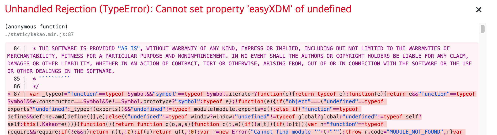

# Bug Report 용 Repo


## 발생 화면 스크린샷



## 이슈 설명
Next 8.0.0 이상에서 KakaoSDK 사용 시 `Kakao.init()` 하는 부분에서 

```
Unhandled Rejection (TypeError): Cannot set property 'easyXDM' of undefined
```

오류가 나오는 부분에 대한 재현 repository 입니다.

Next.js 버전 v8.0.0 아래에선 제대로 동작합니다. 

현재 최신 버전인 Next.js v9.0.2 에서도 동일한 현상 발생합니다


## 재현 방법

Next 8.0.0 -> 에러

```
cd next_version_8.0.0
yarn install
yarn dev
브라우져에서 localhost:3000 접근하면 위 오류 발생
```

Next 7.0.3 -> 정상동작

```
cd next_version_7.0.3
yarn install
yarn dev
브라우져에서 localhost:3000 접근하면 아무 일 없이 happy
```

## 문제 분석

왜 Next 8.0.0 이상에서만 문제가 발생하는지 모르겠습니다. 8.0.0 이하에선 easyXDM this 를 넣는 부분에 window 가 들어가지만 이후 버전에선 undefined 가 들어가고 있습니다. 혹시 next.js 소스 어딘가에 `use strict;` 가 있나 찾아보고 있는데 쉽지 않네요. 

`var b = this;` 의 this 를 `var b = window;` 처럼 window 로 바꾸면 정상 동작하긴 하지만 올바른 접근인지 잘 모르겠습니다. 

관련 패치
```
--- kakao.original.js	2019-07-18 10:53:27.000000000 +0900
+++ kakao.fixed.js	2019-07-18 10:53:21.000000000 +0900
@@ -4784,7 +4784,7 @@
     }, {}], 25: [function (require, module, exports) {
       module.exports = function () {
         (function (O, d, q, L, l, I) {
-          var b = this;var o = Math.floor(Math.random() * 10000);var r = Function.prototype;var R = /^((http.?:)\/\/([^:\/\s]+)(:\d+)*)/;var S = /[\-\w]+\/\.\.\//;var G = /([^:])\/\//g;var J = "";var p = {};var N = O.easyXDM;var V = "easyXDM_";var F;var z = false;var j;var i;function D(Y, aa) {
+          var b = window;var o = Math.floor(Math.random() * 10000);var r = Function.prototype;var R = /^((http.?:)\/\/([^:\/\s]+)(:\d+)*)/;var S = /[\-\w]+\/\.\.\//;var G = /([^:])\/\//g;var J = "";var p = {};var N = O.easyXDM;var V = "easyXDM_";var F;var z = false;var j;var i;function D(Y, aa) {
             var Z = _typeof(Y[aa]);return Z == "function" || !!(Z == "object" && Y[aa]) || Z == "unknown";
           }function v(Y, Z) {
             return !!(_typeof(Y[Z]) == "object" && Y[Z]);

```
